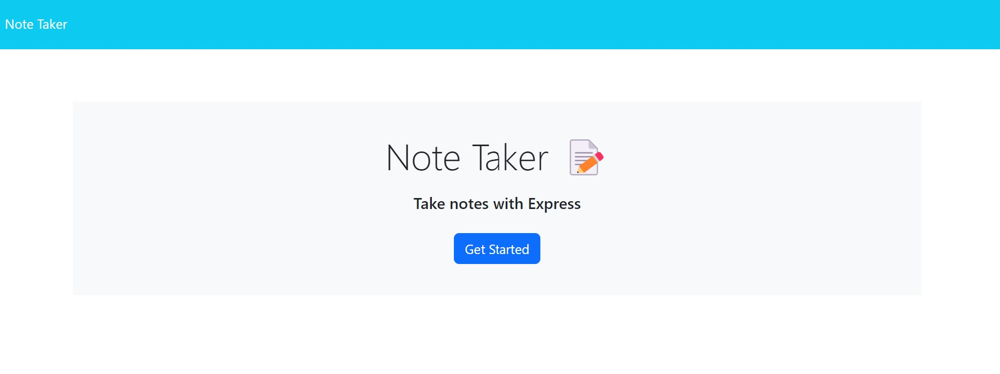
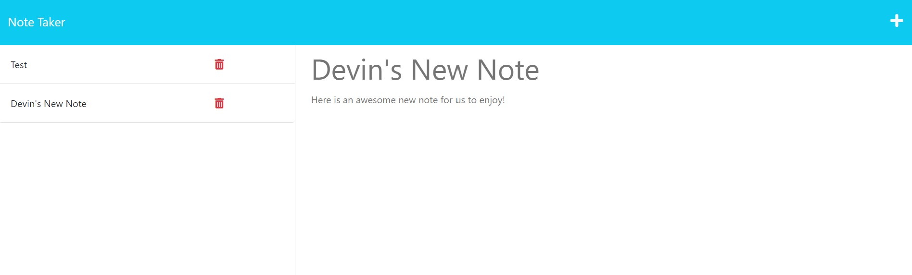

<header style="height: 100px; background: linear-gradient(to right, #000046, #1CB5E0);"><h1 style="font-size: 65px; text-align: center"><strong>Note Taker</strong></h1></header>

 

 

> # [Description](#description)
Here is a very handy note taking web app. If you want to keep track of anything you need to be doing, from grocery lists, to errands to run, this will display each item in an organized and easy to use way. Just enter your note into the app, click save, and it will dispaly for as long as you need it. We also added in a real handy feature to delete the note when you no longer need it.

 
 

---

Table of Contents
 

- [Description](#description)
- [Getting Started](#getting-started)
  - [Project Status](#project-status)
  - [Installation](#installation)
  - [Useage](#useage)
  - [Contributing Guidelines](#contributing)
  - [Test Instructions](#test) 
  - [License](#license)
- [Credits](#credits)
  - [Contributors](#contributors)
  - [Acknowledgements](#acknowledgements)
- [Questions](#questions)

 
 

---

> # [Getting Started](#getting-started)

 

## [Project Status](#project-status)
    MVP - Minimal Viable Product

Follow this link to our [webpage](https://note-taker-devin-reilly.herokuapp.com/) to try the **Note Taker** web app out for yourself!

 

To get a look at the code used for this application, checkout our my <a href="https://github.com/werthird/Note-Taker-Module-11">GitHub Repo!</a> 

 

## [Installation](#installation)
No need for installation. Please click here to see our deployed webpage: **[Note Taker App!](https://note-taker-devin-reilly.herokuapp.com/)**

 

## [Useage](#useage)
Follow these steps for a full walk through of our web app:

1. When you click first enter on the webpage, you will see our landing page. Click on the "Get Started" button.

2. On the right of the webpage will be a text field for you to enter the title and text of the note you want to save.

3. After you have entered it, a save button will appear in the top right of the page that will save your note to our database.

4. If you want to view a saved note, click on it in the left panel, and it will show it on the right.

5. To add a new note after viewing a previous one, just click on the "plus" symbol in the top right of the page.

6. Finally, if you want to delete a note, just click on the delete icon next to the note.
   

 
<h2>Note Taker's Landing Page</h2>

 
<h2>Note Taker Note's Page</h2>

 

## [Contributing Guidelines](#contributing)
No contributing guidelines. For any suggestions or comments, please see [Questions](#questions) section below.

 

## [Test Instructions](#test)
No specific testing instructions.

 

## [License](#license)
Distributed under the MIT License. See LICENSE.txt for more information.

 
 

---

> # [Credits](#credits)

 

## [Contributors](#contributors)
This is built as a UCF Coding bootcamp homework assignment. There was some pre-written code that had to be finished and formulated to meet the assignments requirements.

Finished by Devin Reilly

 

## [Acknowledgements](#acknowledgements)
- UCF GitLab starter code
- [The Full-Stack Blog](https://coding-boot-camp.github.io/full-stack/github/professional-readme-guide) - README Template 
- UCF Instructor **John Dinsmore**, and TA's, **Kristofer Marshall** and **Rider Cogswell**
- Students of UCF Coding Boot Camp, in class, on Slack and on Discord
- Research articles from Google Search, ChatGPT, MDN Docs, W3Schools

 
 

---

> # [Questions](#questions)

Here is a link to our <a href="https://github.com/werthird">GitHub profile page!</a>

Or send us an <a href="mailto: werthird@aol.com?subject=Note Taker Feedback">Email!</a>